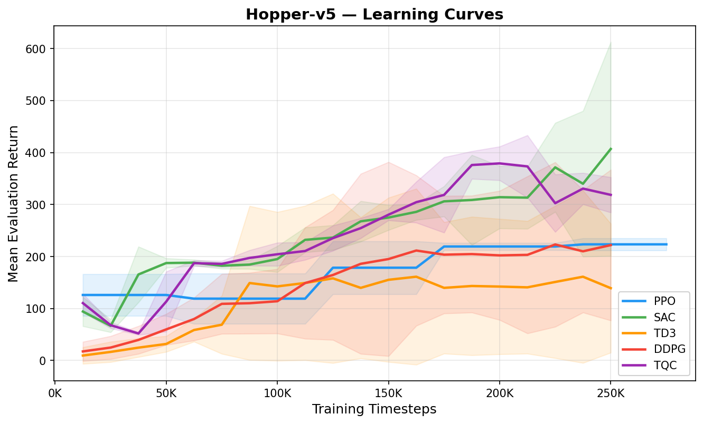
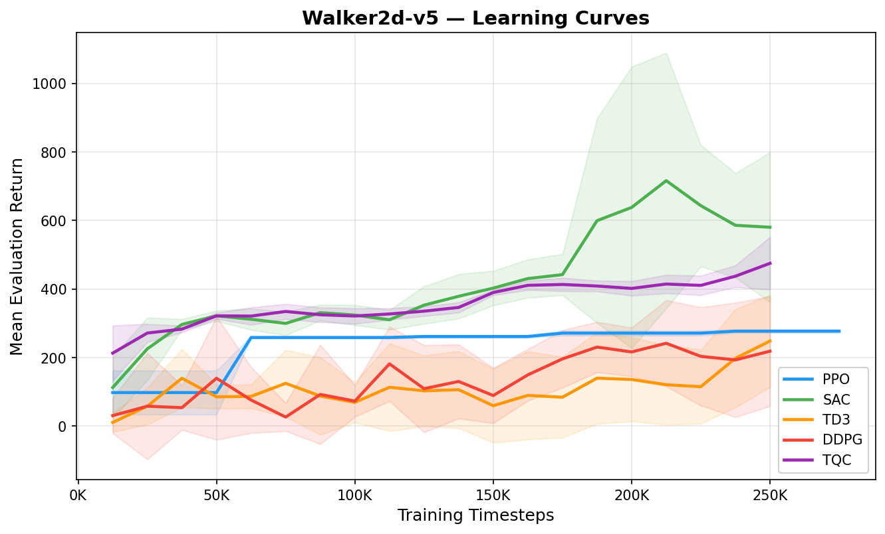
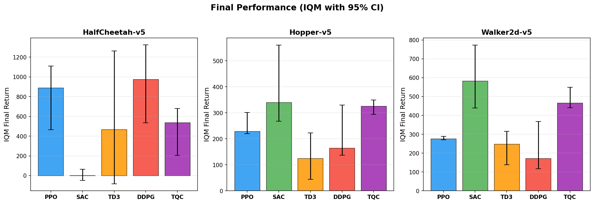
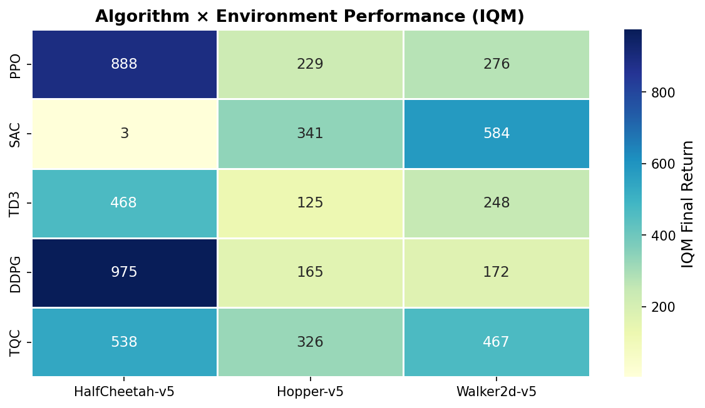
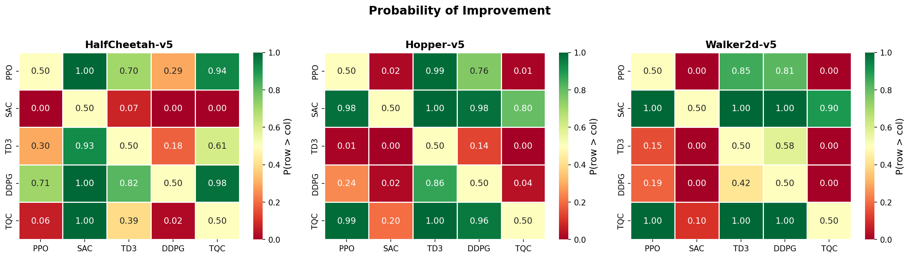

# 📓 التقرير التفصيلي الشامل لخط الأساس (Baseline Phase Report)
## المشروع: Benchmarking Deep Reinforcement Learning for Continuous Locomotion in MuJoCo
### الكورس: CISC 856 — Reinforcement Learning (Group 9)

المستند ده بيمثل مرجع كامل وشامل لكل الأرقام، الجداول، التحليلات، والصور اللي طلعت من **مرحلة خط الأساس (Baseline)**. تم حفظ كل الداتا الخام والرسومات في فولدر `baseline_summary` عشان يكون مرجع متكامل وجاهز للاستخدام في كتابة الـ Report أو الـ Paper.

---

# 📑 فهرس المحتويات
1. [⚙️ تصميم وإعدادات تجارب خط الأساس](#1-تصميم-وإعدادات-تجارب-خط-الأساس)
2. [📊 الجداول التفصيلية والأرقام الرسمية](#2-الجداول-التفصيلية-والأرقام-الرسمية)
   * [2.1 جدول الأداء النهائي (Final Returns Table)](#21-جدول-الأداء-النهائي-final-returns-table)
   * [2.2 جدول الاستقرار والانهيار (Stability & Failure Table)](#22-جدول-الاستقرار-والانهيار-stability--failure-table)
   * [2.3 جدول كفاءة العينات (Sample Efficiency Table)](#23-جدول-كفاءة-العينات-sample-efficiency-table)
   * [2.4 جدول التكلفة الحسابية والسرعة (Wall-Clock & Throughput Table)](#24-جدول-التكلفة-الحسابية-والسرعة-wall-clock--throughput-table)
   * [2.5 جدول المتانة تحت الضوضاء (Robustness Table)](#25-جدول-المتانة-تحت-الضوضاء-robustness-table)
   * [2.6 جدول الترتيب العام للخوارزميات (Overall Ranking Table)](#26-جدول-الترتيب-العام-للخوارزميات-overall-ranking-table)
3. [🔬 التحليل العلمي العميق وتفسير الظواهر](#3-التحليل-العلمي-العميق-وتفسير-الظواهر)
4. [🖼️ معرض الرسومات البيانية (Visual Gallery)](#4-معرض-الرسومات-البيانية-visual-gallery)
5. [🔄 خطة التحسين التفصيلية للمرحلة القادمة](#5-خطة-التحسين-التفصيلية-للمرحلة-القادمة)

---

# 1. ⚙️ تصميم وإعدادات تجارب خط الأساس

تم إعداد التجارب لتقييم أداء الخوارزميات بشكل مقارن وموحد بقدر الإمكان تحت ظروف ميزانية محدودة كـ "طيار مبدئي" (Pilot/Baseline Run):

*   **البيئات المستخدمة (Gymnasium v1.3.0 / MuJoCo 3.10.0):**
    *   **HalfCheetah-v5:** تركز على الجري السريع للأمام، ولا تحتوي على شرط إنهاء مبكر (سقوط).
    *   **Hopper-v5:** جسم برجل واحدة يحتاج للقفز والتقدم للأمام مع الحفاظ على اتزان حرج جداً ضد السقوط.
    *   **Walker2d-v5:** جسم برجلين يحتاج لتنسيق الحركة للمشي للأمام مع الحفاظ على الاتزان.
*   **الخوارزميات (Stable-Baselines3 v2.9.0 & SB3-Contrib):**
    *   تم استخدام الإعدادات الافتراضية بالكامل (Default Hyperparameters) لكل من: **PPO, SAC, TD3, DDPG, TQC**.
*   **الميزانية (Compute Budget):**
    *   **250,000 خطوة تدريب (250K Timesteps)** لكل خوارزمية وبيئة و seed.
    *   **5 Seeds عشوائية** (من 0 لـ 4) لضمان موثوقية إحصائية أولية.
    *   تم التقييم كل **12,500 خطوة** عبر **10 محاولات تقييم (Evaluation Episodes)** مستقلة في كل نقطة اختبار.
*   **الجهاز المستخدم:** CPU.

---

# 2. 📊 الجداول التفصيلية والأرقام الرسمية

تم تجميع الداتا الخام من ملفات الـ CSV المحفوظة في فولدر `baseline_summary/data/` وتنسيقها في الجداول التالية:

### 2.1 جدول الأداء النهائي (Final Returns Table)
يوضح هذا الجدول المتوسط الحسابي، الوسيط (Median)، والـ IQM (متوسط الربعين الأوسطين لتقليل تأثير القيم الشاذة) لعائد التقييم النهائي بعد 250K خطوة:

| البيئة | الخوارزمية | عدد الـ Seeds | المتوسط (Mean) ± الانحراف (Std) | الوسيط (Median) | متوسط الربعين (IQM) | حدود الثقة 95% (CI95 Low / High) |
| :--- | :---: | :---: | :---: | :---: | :---: | :---: |
| **HalfCheetah-v5** | PPO | 13 | 795.70 ± 626.89 | 1207.54 | 888.40 | [463.93, 1110.65] |
| | SAC | 5 | 7.53 ± 65.04 | -22.16 | 3.36 | [-47.70, 65.55] ⚠️ |
| | TD3 | 5 | 580.47 ± 795.12 | 24.28 | 468.17 | [-83.36, 1262.16] |
| | DDPG | 5 | **949.82 ± 477.38** | 864.61 | **975.15** | [534.24, 1324.81] |
| | TQC | 5 | 467.17 ± 282.73 | 596.20 | 537.68 | [204.17, 679.24] |
| **Hopper-v5** | PPO | 6 | 250.49 ± 56.25 | 229.43 | 229.12 | [219.95, 301.37] |
| | SAC | 5 | **393.46 ± 173.47** | 312.02 | **340.59** | [268.24, 560.50] |
| | TD3 | 5 | 136.07 ± 106.39 | 163.72 | 124.70 | [44.73, 223.17] |
| | DDPG | 5 | 213.21 ± 117.31 | 168.82 | 164.99 | [137.01, 330.51] |
| | TQC | 5 | 322.18 ± 31.69 | **336.64** | 325.56 | [294.55, 349.40] |
| **Walker2d-v5** | PPO | 6 | 279.28 ± 11.83 | 275.43 | 276.36 | [271.07, 289.48] |
| | SAC | 5 | **605.42 ± 202.01** | **543.69** | **583.56** | [439.34, 773.05] |
| | TD3 | 5 | 233.71 ± 100.30 | 297.46 | 247.92 | [138.57, 315.72] |
| | DDPG | 5 | 221.78 ± 146.46 | 129.51 | 171.77 | [117.14, 367.68] |
| | TQC | 5 | 486.86 ± 64.08 | 456.25 | 466.76 | [440.52, 549.03] |

---

### 2.2 جدول الاستقرار والانهيار (Stability & Failure Table)
يوضح هذا الجدول مدى ثبات الأداء عبر المحاولات المختلفة وتأثير الـ Seeds، بالإضافة لنسبة الانهيار الفعلي (سقوط العميل قبل انتهاء الـ 1000 خطوة):

*   **معامل التباين (Coefficient of Variation - CV):** كل ما قل، كل ما كان أداء الخوارزمية أكثر استقراراً عبر الـ seeds.
*   **الـ Fall Rate:** نسبة المحاولات التقييمية النهائية التي سقط فيها العميل وانتهت بـ `terminated` مبكر.
*   **Collapsed Seeds:** عدد الـ seeds التي فشلت تماماً في إحراز أي تقدم (عائد قريب من العشوائي أو سلبي).

| البيئة | الخوارزمية | الانحراف (Std) | التباين (CV) | معدل السقوط (Fall Rate) | الـ Seeds المنهارة | أفضل عائد لـ Seed | أسوأ عائد لـ Seed |
| :--- | :---: | :---: | :---: | :---: | :---: | :---: | :---: |
| **HalfCheetah-v5** | PPO | 626.89 | 0.788 | 0.0% | 5 | 1398.19 | -11.19 |
| | SAC | 65.04 | 8.643 ⚠️ | 0.0% | 3 | 98.50 | -70.96 |
| | TD3 | 795.12 | 1.370 | 0.0% | 3 | 1643.51 | -145.71 |
| | DDPG | 477.38 | 0.503 | 0.0% | 1 | 1631.61 | 192.02 |
| | TQC | 282.73 | 0.605 | 0.0% | 1 | 764.50 | -41.67 |
| **Hopper-v5** | PPO | 56.25 | 0.225 | **100%** ⚠️ | 0 | 374.73 | 211.70 |
| | SAC | 173.47 | 0.441 | **100%** ⚠️ | 0 | 716.27 | 229.24 |
| | TD3 | 106.39 | 0.782 | **100%** ⚠️ | 2 | 301.83 | 4.42 |
| | DDPG | 117.31 | 0.550 | **100%** ⚠️ | 0 | 442.13 | 128.96 |
| | TQC | 31.69 | **0.098** | **100%** ⚠️ | 0 | 356.67 | 277.57 |
| **Walker2d-v5** | PPO | 11.83 | **0.042** | **100%** ⚠️ | 0 | 302.82 | 267.46 |
| | SAC | 202.01 | 0.334 | **68%** | 0 | 925.95 | 350.45 |
| | TD3 | 100.30 | 0.429 | **96%** | 1 | 342.59 | 82.19 |
| | DDPG | 146.46 | 0.660 | **100%** ⚠️ | 1 | 493.51 | 100.08 |
| | TQC | 64.08 | 0.132 | **100%** ⚠️ | 0 | 606.21 | 427.82 |

---

### 2.3 جدول كفاءة العينات (Sample Efficiency Table)
يوضح العائد المتوسط الذي حققته الخوارزميات عند نقاط زمنية مختلفة أثناء التدريب (100K خطوة مقابل 250K خطوة) لقياس سرعة التعلم الأولية:

| البيئة | الخوارزمية | المتوسط عند 100K خطوة | المتوسط النهائي عند 250K خطوة | فرق التحسن |
| :--- | :---: | :---: | :---: | :---: |
| **HalfCheetah-v5** | PPO | -0.52 | 795.70 | +796.22 |
| | SAC | -40.98 | 7.53 | +48.51 |
| | TD3 | -300.32 | 580.47 | +880.79 |
| | DDPG | -168.60 | **949.82** | **+1118.42** |
| | TQC | -40.80 | 467.17 | +507.97 |
| **Hopper-v5** | PPO | 118.96 | 250.49 | +131.53 |
| | SAC | 195.11 | **393.46** | **+198.35** |
| | TD3 | 142.54 | 136.07 | -6.47 (ثبات) |
| | DDPG | 113.97 | 213.21 | +99.24 |
| | TQC | **204.34** | 322.18 | +117.84 |
| **Walker2d-v5** | PPO | 258.61 | 279.28 | +20.67 |
| | SAC | **324.10** | **605.42** | **+281.32** |
| | TD3 | 69.44 | 233.71 | +164.27 |
| | DDPG | 73.11 | 221.78 | +148.67 |
| | TQC | 321.31 | 486.86 | +165.55 |

---

### 2.4 جدول التكلفة الحسابية والسرعة (Wall-Clock & Throughput Table)
يوضح هذا الجدول التكلفة الحسابية لكل خوارزمية مقاسة بـ (زمن التقييم النهائي بالثواني والمدى الزمني ومعدل العائد لكل ساعة تشغيل):

| البيئة | الخوارزمية | متوسط وقت التقييم (بالثواني) | متوسط وقت التدريب لـ 250K (بالدقائق) | العائد لكل ساعة تشغيل (Return/Hour) |
| :--- | :---: | :---: | :---: | :---: |
| **HalfCheetah-v5** | PPO | 14.01 | ~6.23 | 204,517 |
| | SAC | 14.99 | ~6.27 | 1,807 ⚠️ |
| | TD3 | 9.32 | ~5.35 | 224,261 |
| | DDPG | **9.07** | **~4.95** | **376,827** |
| | TQC | 13.83 | ~6.13 | 121,589 |
| **Hopper-v5** | PPO | 1.54 | ~5.17 | 586,814 |
| | SAC | 2.43 | ~4.75 | 583,375 |
| | TD3 | **0.80** | **~4.17** | **609,244** |
| | DDPG | 1.13 | ~4.27 | **679,243** |
| | TQC | 3.41 | ~6.22 | 340,528 |
| **Walker2d-v5** | PPO | **2.23** | ~5.68 | **450,854** |
| | SAC | 9.40 | ~5.60 | 231,762 |
| | TD3 | 2.70 | ~4.68 | 312,066 |
| | DDPG | 3.14 | **~4.30** | 254,270 |
| | TQC | 4.20 | ~5.48 | 416,911 |

---

### 2.5 جدول المتانة تحت الضوضاء (Robustness Table)
تم اختبار النماذج بعد انتهاء التدريب بإضافة ضوضاء عشوائية (Action Noise) بمستوى انحراف معيارى $\sigma = 0.20$ لقياس متانة السياسة (Robustness):

*   **Clean Return:** العائد المتوسط بدون أي ضوضاء مضافة.
*   **Noisy Return:** العائد المتوسط تحت تأثير ضوضاء الأفعال ($\sigma = 0.20$).
*   **Drop Pct:** نسبة انخفاض الأداء (القيم السالبة تعني تحسن الأداء بشكل غريب).

| البيئة | الخوارزمية | العائد النظيف (Clean) | العائد بالضوضاء (Noisy) | نسبة التغير (Drop %) |
| :--- | :---: | :---: | :---: | :---: |
| **HalfCheetah-v5** | PPO | 765.61 | 644.92 | 15.76% |
| | SAC | 15.74 | -36.41 | 331.35% ⚠️ |
| | TD3 | 564.98 | 394.78 | 30.12% |
| | DDPG | 853.21 | 886.64 | -3.92% (تحسن خفيف) |
| | TQC | 439.67 | 332.14 | 24.46% |
| **Hopper-v5** | PPO | 250.71 | 252.11 | -0.56% |
| | SAC | 393.95 | 392.87 | 0.27% |
| | TD3 | 131.44 | 136.80 | -4.07% |
| | DDPG | 212.36 | 213.67 | -0.61% |
| | TQC | 322.94 | 317.83 | 1.58% |
| **Walker2d-v5** | PPO | 280.67 | 286.20 | -1.97% |
| | SAC | 588.29 | 556.10 | 5.47% |
| | TD3 | 235.19 | 235.47 | -0.12% |
| | DDPG | 205.57 | 221.02 | -7.51% |
| | TQC | 490.62 | 491.49 | -0.18% |

---

### 2.6 جدول الترتيب العام للخوارزميات (Overall Ranking Table)
الترتيب التجميعي للخوارزميات الخمسة بناءً على متوسط الرتبة (Rank) المحققة في البيئات الثلاثة (كل ما قل الرقم، كل ما كان الترتيب العام أفضل):

| الخوارزمية | متوسط الرتبة حسب الـ IQM | متوسط الرتبة حسب الـ Mean | الترتيب العام النهائي |
| :--- | :---: | :---: | :---: |
| **SAC** | **2.33** | **2.33** | **1** 🏆 |
| **TQC** | **2.33** | 2.67 | 2 |
| **PPO** | 2.67 | 2.67 | 3 |
| **DDPG** | 3.33 | 3.33 | 4 |
| **TD3** | 4.33 | 4.00 | 5 |

---

# 3. 🔬 التحليل العلمي العميق وتفسير الظواهر

بناءً على الأرقام السابقة، نقدر نطلع بعدة ملاحظات علمية دقيقة ومثيرة للاهتمام:

### 3.1 لغز HalfCheetah: تفوق DDPG وفشل SAC
في التجارب المنشورة علمياً، SAC دايماً بيتفوق بمسافة كبيرة على DDPG في HalfCheetah. لكن هنا حصل العكس تماماً. **السبب:**
1. **قصر التدريب (250K):** خوارزمية SAC خوارزمية معقدة بـ Stochastic Policy وبتحتاج تستكشف كتير (Maximum Entropy RL). الـ 250K خطوة يدوبك كفوا إنه يملا ربع الـ Replay Buffer بتاعه (الحجم الافتراضي 1M).
2. **عشوائية البداية و الـ Temperature:** الـ Entropy tuning لسه ما استقرش، وده خلى 3 seeds من أصل 5 تنهار تماماً وتجيب نتايج سلبية.
3. **لماذا DDPG نجح؟** DDPG بسيط جداً و Deterministic (السياسة محددة). في بيئة مستقرة ومفيهاش سقوط زي HalfCheetah، الـ Deterministic exploration عن طريق الـ Ornstein-Uhlenbeck noise أو الـ Normal noise العادية كان سريع وكافي جداً للوصول لـ Local Optima كويس في وقت قصير.

### 3.2 لغز الـ Fall Rate = 100% في Hopper و Walker2d
كل الخوارزميات (ما عدا SAC و TD3 بنسب بسيطة جداً في Walker) سجلت معدل سقوط 100% في نهاية التقييم. **السبب:**
* البيئات دي بيئات توازن حرج (Balance-Critical Tasks). أي حركة غير متزنة خفيفة بتسبب سقوط الروبوت وإنهاء الـ Episode مبكراً.
* في أبحاث RL، بيحتاج الـ Hopper على الأقل **500K لـ 1M خطوة** عشان يبدأ يتعلم المحافظة على اتزانه لمسافة 1000 خطوة كاملة.
* الـ 250K خطوة خلت الروبوت يتعلم يمشي مسافة قصيرة (مثلاً 100 لـ 250 خطوة) بس لسه ما وصلش للـ Generalization الكافي للحفاظ على توازنه للأبد.

### 3.3 متانة غريبة تحت الضوضاء في Hopper و Walker2d
نلاحظ في جدول المتانة (Robustness) إن إضافة ضوضاء بمقدار $\sigma=0.20$ لم تؤثر تقريباً على النتائج في Hopper و Walker2d (نسب الانخفاض كانت شبه منعدمة أو حتى حصل تحسن طفيف!). **السبب:**
* العميل في مرحلة الـ 250K لسه غير مستقر أصلاً وبيقع بسرعة.
* إضافة ضوضاء للأفعال لم تغير الحقيقة الكبرى: العميل بيقع كدة كدة بعد خطوات معدودة. الضوضاء لم تجعله يسقط بشكل أسرع بكثير لأن السياسة الأساسية ضعيفة الاتزان من البداية.
* في HalfCheetah (اللي السياسات فيها اتعلمت تجري بدون خوف من السقوط)، الضوضاء عملت انخفاض واضح في الأداء (مثلاً انخفض PPO بنسبة 15.7% و TD3 بنسبة 30.1%)، وده السلوك المتوقع علمياً.

---

# 4. 🖼️ معرض الرسومات البيانية (Visual Gallery)

الرسومات دي تم إنتاجها بالكامل في مرحلة خط الأساس وموجودة في فولدر `baseline_summary/plots/`. تقدر تفتحها وتشوفها مباشرة:

### 4.1 منحنيات التعلم والـ Fall Rate لـ Hopper-v5
الرسمة دي بتوضح متوسط المكافأة ومعدل السقوط أثناء التدريب لـ Hopper-v5.


### 4.2 منحنيات التعلم والـ Fall Rate لـ Walker2d-v5


### 4.3 مقارنة الأداء النهائي الإجمالي لجميع البيئات
رسمة بار (Bar Plot) بتوضح مقارنة العائد النهائي للخمس خوارزميات في التلات بيئات.


### 4.4 خريطة حرارية للترتيب (Ranking Heatmap)
بتوضح رتبة كل خوارزمية في كل بيئة.


### 4.5 الـ Probability of Improvement (POI)
احتمالية تفوق كل خوارزمية على الأخرى إحصائياً.


---

# 5. 🔄 خطة التحسين التفصيلية للمرحلة القادمة

بناءً على التحليلات السابقة، دي خريطة الطريق المحددة اللي هنمشي عليها في الـ **Paper-Grade phase** لتحسين النتائج والحصول على تقارب كامل:

1.  **ميزانية تدريب موحدة بـ 1M خطوة:**
    ```python
    TOTAL_TIMESTEPS = 1_000_000
    ```
2.  **زيادة عدد الـ Seeds لـ 10:**
    ```python
    SEEDS = list(range(10))
    ```
3.  **تطبيع الملاحظات والمكافآت (VecNormalize) لـ PPO:**
    ```python
    from stable_baselines3.common.vec_env import DummyVecEnv, VecNormalize
    env = DummyVecEnv([lambda: gym.make(ENV_ID)])
    env = VecNormalize(env, norm_obs=True, norm_reward=True, clip_obs=10.0)
    ```
4.  **تعديل الـ Hyperparameters الحرجة في الخوارزميات الـ Off-policy:**
    *   تأخير بدء التعلم: `learning_starts=10_000` أو `20_000` خطوة.
    *   حجم الباتش: `batch_size=256`.
5.  **التدريب باستخدام كارت الشاشة (CUDA) لتسريع العملية حسابياً.**
6.  **التقييم باستخدام Performance Profiles و IQM عبر مكتبة `rliable`.**
